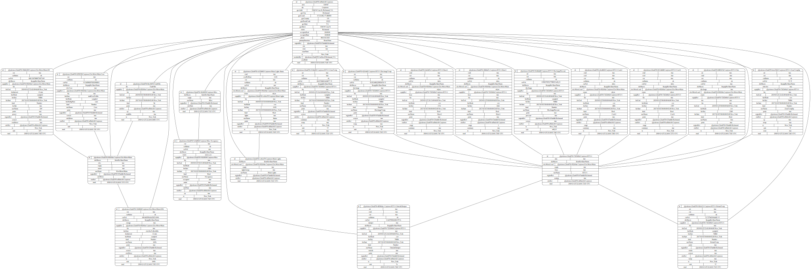

Very simple example that reads a haystack json from stdin and generates a dot compatible version.

It relies on the `gonum/graph` package.

Example using the public file [carytown](https://github.com/BrickSchema/brick-examples/blob/master/haystack/carytown.json):

```
curl -s https://raw.githubusercontent.com/BrickSchema/brick-examples/master/haystack/carytown.json | go run main.go| dot -T svg > carytown.svg
```

gives:


